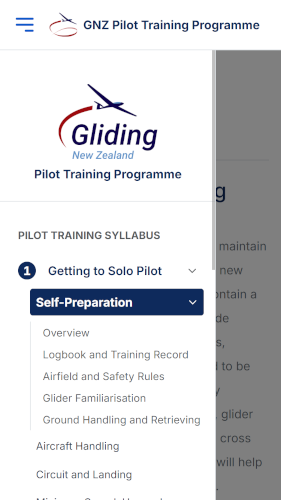

# Gliding New Zealand Training Wordpress Theme

This Classic Wordpress theme was created for GNZ's training syllabus website. I first used Gemini 3 Pro to build a wireframe (because I suck at design), then used GPT-5-Codex to build this theme and iterate on the UX (with some professional supervision and manual tweaks).

## Technology choices
I chose the Classic theme style for maximum customisability and due to the immaturity of the Block themes (and the Gutenberg editor). There are millions of Classic theme sites, so hopefully Wordpress continues to support this for many years.

I based most of the visual customisation using Bootstrap 5.3 because that's what I have experience with - it's imported from a public CDN in `functions.php`.

## Using the theme

### Creating pages
You will need to create a lot of pages. Please follow this guidance:

1. Set the page's Parent. You can do this in the right side menu when editing a page, or under "Quick Edit" on the Page list view. This keeps the structure of the content matching the menu and makes maintenance easier. It also powers the `Getting to Solo Pilot > Self Preparation` breadcrumbs at the top of the page.
2. Set the page's Slug. This is the part of the URL that represents the page. Keep it short, unique, and consistent (lowercase and separated by hyphens). This is part of the design - we don't want long overly verbose URLs, or cryptic ones. For example "Getting to Solo Pilot" can be `/solo`. Consider the URL in context. Wordpress will generate `/pilot-training-syllabus/getting-to-solo-pilot/self-preparation#ground-handling-and-retrieving` by default, but  `/pilot/solo/self-prep#handling` is so much better. Once we set this, we can't change it without breaking peoples' links.

### Menu structure
The beating heart of this theme is the menu structure, which attempts to provide direct and initiative navigation through a complex hierarchical collection of syllabi.

The layout and customisation of the menu is performed by logging into the admin portal at `/wp-admin`, and navigating to `Appearance > Menus`. From here you can pick Pages from a left sidebar, and drag them into the menu hierarchy. The behaviour of the hierarchy is:

1. Top level Pages' titles show in grey, and in capitals. An example in this screenshot is `PILOT TRAINING SYLLABUS`. You may notice a `CSS Classes (optional)` field in the menu editor. If you set `enable-stage-numbers` in that field on a top level Page, the next level down gets numbers. `PILOT TRAINING SYLLABUS` has this set, so "Getting to Solo Pilot" is numbered.
2. Second level Pages's titles represent stages. These expand when clicked on to reveal the actual pages that users visit. In this example, it is `Getting to Solo Pilot`.
3. Third level Pages contain the actual content. An example of this is Self-Preparation. When you click on it, it expands to show the H1 headings on the page. These are populated automatically. These headings only appear when they have an HTML anchor set. You can set this by editing the page, clicking on each heading, expanding "advanced" in the right side bar, and entering a value under `HTML ANCHOR`. These are shown in the URL, so choose something short, lowercase, and separated by hypens. For example, if the heading is "Ground Handling and Retrieving" you could simply set the anchor to "handling". This would make the URL `/pilot/solo/self-prep#handling`.

